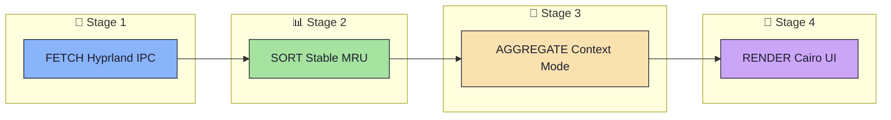
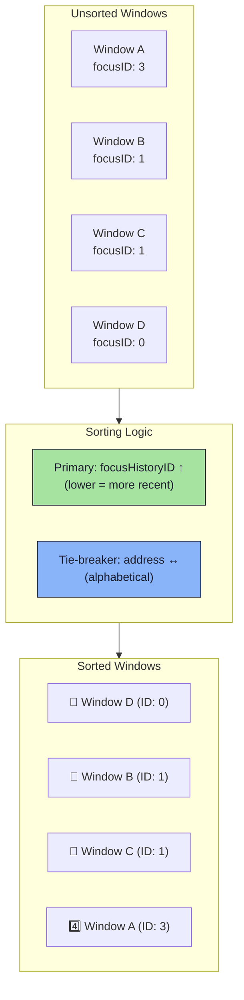
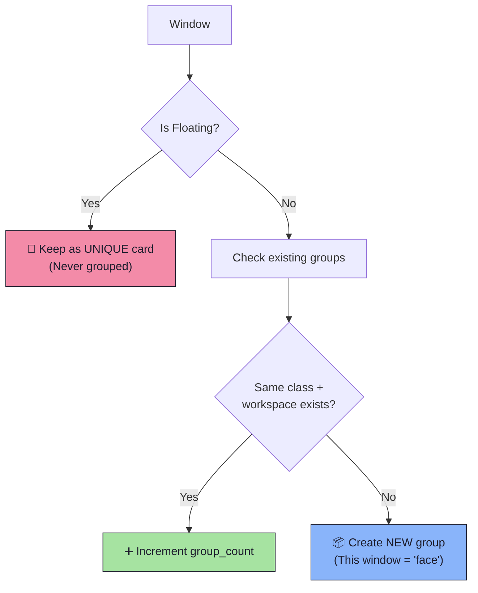
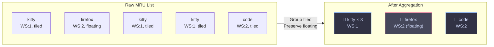
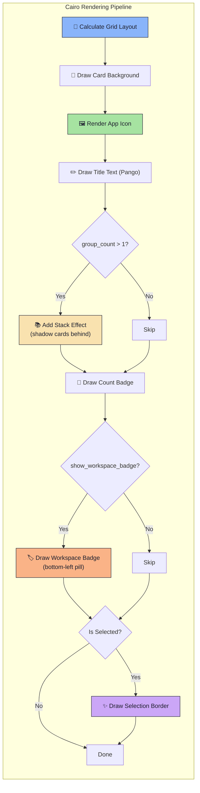
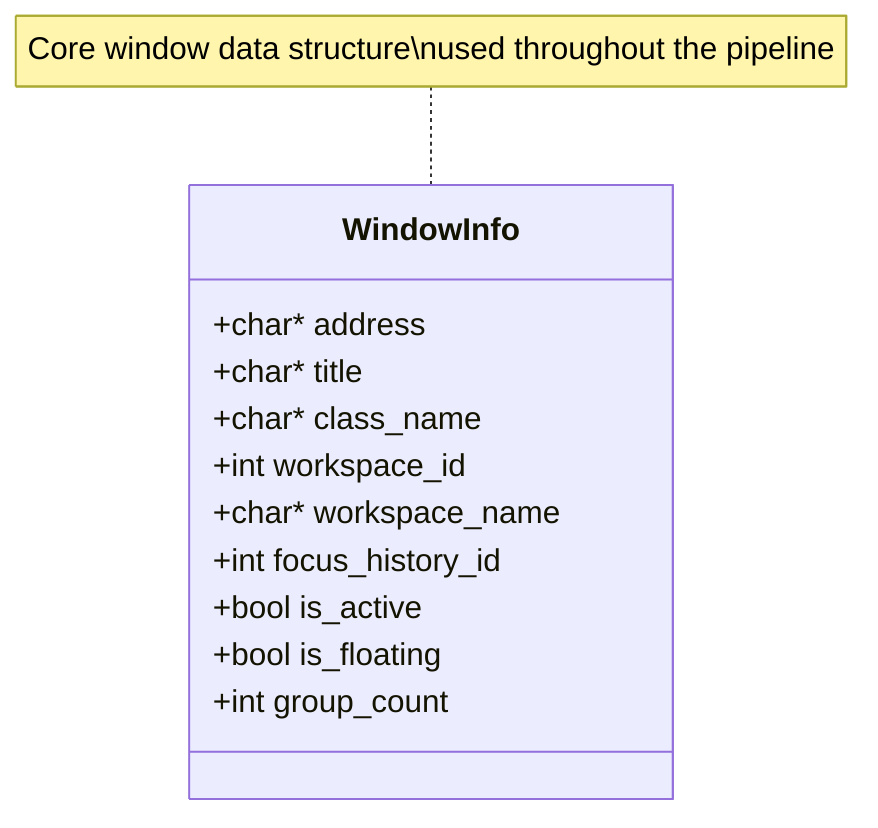
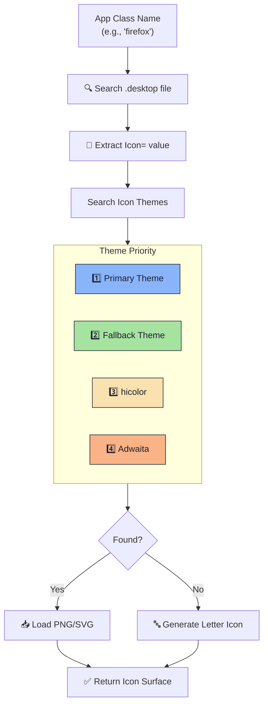
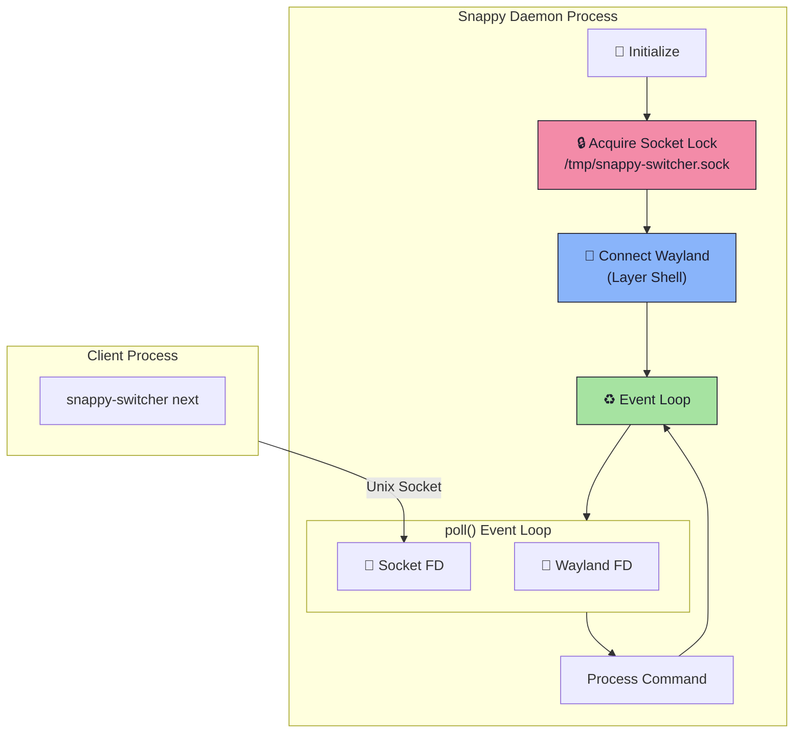
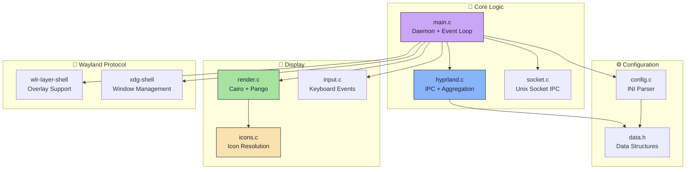

<div align="center">

# 🏗️ Snappy Switcher Architecture

*A deep dive into how Snappy Switcher processes and displays your windows*

</div>

---

## 📋 Overview

Snappy Switcher is a Wayland window switcher for Hyprland that supports two modes:

| Mode | Description |
|------|-------------|
| **Overview** | Shows all windows individually (like traditional Alt-Tab) |
| **Context** | Intelligently groups tiled windows by "Task" (Workspace + App Class) |

---

## 🔄 Pipeline Architecture

The window handling follows a clear **4-stage pipeline**:



---

## 📡 Stage 1: Fetch (Hyprland IPC)

**File**: [`src/hyprland.c`](../src/hyprland.c) → `parse_clients()`

```mermaid
sequenceDiagram
    participant D as Daemon
    participant S as Hyprland Socket
    participant H as Hyprland

    D->>S: Connect to $XDG_RUNTIME_DIR/hypr/$SIGNATURE/.socket.sock
    D->>H: Send "j/clients"
    H-->>D: JSON Response
    
    Note over D: Parse window data

        Note over D: Extract per window:<br/>• address (unique ID)<br/>• title<br/>• class (app name)<br/>• workspace.id<br/>• workspace.name<br/>• focusHistoryID<br/>• floating (bool)
    end
```

**Extracted Fields:**

| Field | Type | Description |
|-------|------|-------------|
| `address` | `string` | Unique window identifier (hex) |
| `title` | `string` | Window title text |
| `class` | `string` | App class name (e.g., `kitty`, `firefox`) |
| `workspace.id` | `int` | Workspace number |
| `workspace.name` | `string` | Workspace name (e.g., `"1"`, `"music"`, `"special:scratchpad"`) |
| `focusHistoryID` | `int` | MRU position (0 = most recent) |
| `floating` | `bool` | Tiled or floating window |

---

## 📊 Stage 2: Sort (Stable MRU)

**File**: [`src/hyprland.c`](../src/hyprland.c) → `compare_mru()`



**Sorting Algorithm:**

```c
int diff = wa->focus_history_id - wb->focus_history_id;
if (diff != 0) return diff;
return strcmp(wa->address, wb->address);  // Stable tie-breaker
```

---

## 🧩 Stage 3: Aggregate (Context Mode)

**File**: [`src/hyprland.c`](../src/hyprland.c) → `aggregate_context()`

> ⚠️ **Only runs when** `config->mode == MODE_CONTEXT`

### Aggregation Rules



### Visual Example



| Window Type | Behavior |
|-------------|----------|
| **Floating** | ❌ NEVER grouped — always unique card |
| **Tiled** | ✅ Grouped by `workspace_id + class_name` |

---

## 🎨 Stage 4: Render (Cairo UI)

**File**: [`src/render.c`](../src/render.c)



**Rendering Features:**

| Feature | Description |
|---------|-------------|
| **Grid Layout** | Dynamic columns up to `max_cols` |
| **Stack Effect** | Shadow cards behind grouped windows |
| **Count Badge** | Bottom-right circle badge for groups |
| **Workspace Badge** | Bottom-left pill showing workspace ID, named workspace letter, or `[S]` for special workspaces. Floating windows get an `F:` prefix. |
| **Selection Glow** | Highlighted border on selected card |

---

## 📦 Data Structures

### WindowInfo

**File**: [`src/data.h`](../src/data.h)



```c
typedef struct {
  char *address;        // Window address (hex)
  char *title;          // Window title
  char *class_name;     // App class name
  int workspace_id;     // Workspace number
  char *workspace_name; // Workspace name (e.g. "1", "music", "special:scratchpad")
  int focus_history_id; // MRU position
  bool is_active;       // Currently focused?
  bool is_floating;     // Floating or tiled?
  int group_count;      // Number of windows in group
} WindowInfo;
```

### Config

**File**: [`src/config.h`](../src/config.h)

```c
typedef enum { MODE_OVERVIEW, MODE_CONTEXT } ViewMode;

typedef struct {
  ViewMode mode;        // Overview or Context
  int max_cols;         // Grid column limit
  char icon_theme[64];  // Icon theme name
  // ... colors, dimensions
} Config;
```

---

## 🖼️ Icon Loading

**File**: [`src/icons.c`](../src/icons.c)



---

## 🔧 Daemon Architecture

**File**: [`src/main.c`](../src/main.c)



### Available Commands

| Command | Description |
|---------|-------------|
| `next` | Cycle to next window |
| `prev` | Cycle to previous window |
| `toggle` | Show/hide switcher |
| `hide` | Force hide overlay |
| `select` | Confirm current selection |
| `quit` | Stop the daemon |

---

## 📁 File Overview



---

<div align="center">

**[← Back to README](../README.md)** · **[Configuration Guide →](CONFIGURATION.md)**

</div>
